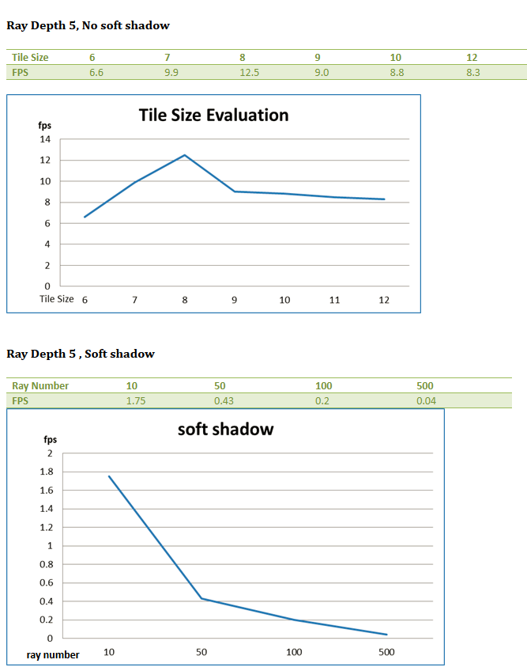

-------------------------------------------------------------------------------
CIS565: Project 1: CUDA Raytracer
-------------------------------------------------------------------------------
Yuqin Shao
-------------------------------------------------------------------------------

-------------------------------------------------------------------------------
VEDIO DEMO
-------------------------------------------------------------------------------

-------------------------------------------------------------------------------
FEATURES
-------------------------------------------------------------------------------
* Raycasting from a camera into a scene through a pixel grid
* Phong lighting for one point light source
* Diffuse lambertian surfaces
* Raytraced shadows
* Cube intersection testing
* Sphere surface point sampling
* Specular reflection 
* Soft shadows and area lights 
* Interactive camera 
	Mouse interaction with right click and drag to zoom in/out, with left click and drag to rotate

-------------------------------------------------------------------------------
SCREEN SHOTS
-------------------------------------------------------------------------------
Diffuse Only

Specular Highlights

Reflection

Soft Shadow

-------------------------------------------------------------------------------
PERFORMANCE EVALUATION
-------------------------------------------------------------------------------

